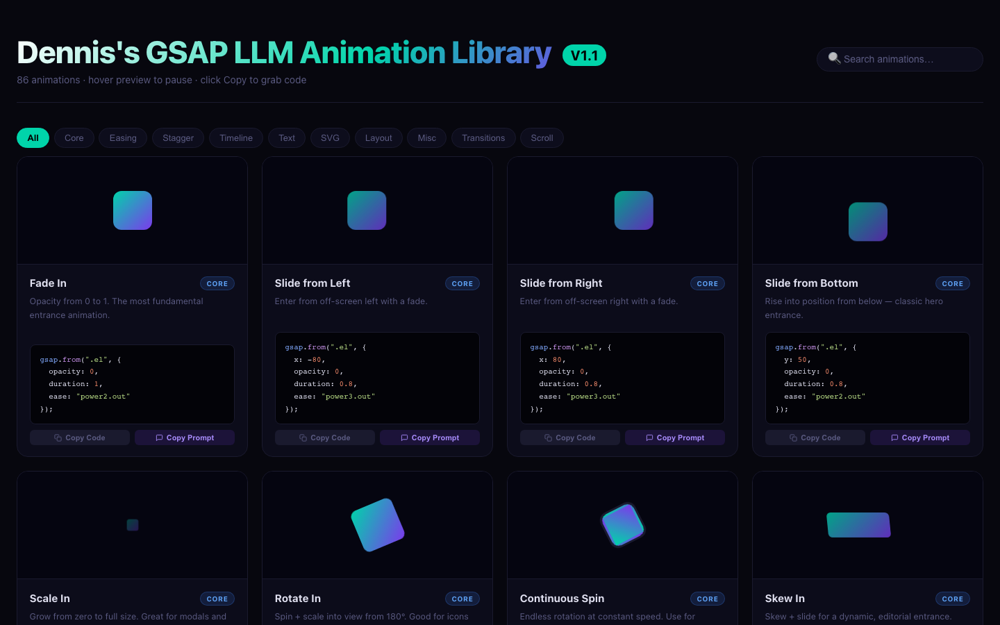

# Dennis's LLM Animation Library · V1.1

A personal reference library of **106 animations** (86 GSAP + 20 Three.js) — each with a live preview, one-click code copy, and an AI-ready prompt copy. Built to quickly find, preview, and reuse animations across future projects.



---

## Features

- **106 animations** across 14 categories (GSAP + Three.js)
- **Live previews** — every card animates in real time; hover to pause
- **Copy Code** — grab production-ready code instantly
- **Copy Prompt** — copy an AI prompt for that animation to use with ChatGPT, Claude, etc.
- **Filter by category** — GSAP: Core, Easing, Stagger, Timeline, Text, SVG, Layout, Misc, Transitions, Scroll · Three.js: Shaders, 3D Text, 3D Transitions, 3D UI
- **Search** — find any animation by name, tag, or description
- Dark theme · responsive 3-column grid · separate GSAP and Three.js sections

---

## Categories

### GSAP (86 animations)

| Category | Count | Description |
|---|---|---|
| **Core** | 10 | Fade, slide, scale, rotate, clip — the fundamentals |
| **Easing** | 6 | Elastic, bounce, custom curves, wiggle |
| **Stagger** | 4 | Group animations with sequenced delays |
| **Timeline** | 3 | Sequenced multi-step choreography |
| **Text** | 26 | SplitText, ScrambleText, typewriter, wave, glitch and more |
| **SVG** | 4 | DrawSVG, MorphSVG, MotionPath |
| **Layout** | 3 | FLIP layout transitions, 3D card, parallax |
| **Misc** | 6 | Magnetic, ripple, elastic trail, glow pulse |
| **Transitions** | 12 | Cross-fade, slide, wipe, curtain, circle reveal, 3D flip, blocks |
| **Scroll** | 12 | ScrollTrigger fade, scrub, parallax, pin, horizontal, counter |

### Three.js (20 animations)

| Category | Count | Description |
|---|---|---|
| **Shaders** | 5 | FBM plasma, aurora borealis, hologram grid, SDF raymarching, hypnotic tunnel |
| **3D Text** | 4 | Vertex wave, cyberpunk neon, curtain reveal, RGB glitch |
| **3D Transitions** | 4 | Wave wipe, noise dissolve, vortex swirl, pixel block stagger |
| **3D UI** | 7 | Glow orb, ripple burst, wireframe icosahedron, DNA helix, spiral galaxy, fire sparks, particle nebula |

---

## Installation

```bash
# 1. Clone the repo
git clone https://github.com/ginccreative/dennis-gsap-library.git
cd dennis-gsap-library

# 2. Install dependencies
npm install

# 3. Start the dev server
npm run dev
```

Then open **http://localhost:5173** in your browser.

---

## Usage

### Browse & preview
Scroll through the grid or use the **filter buttons** at the top to narrow by category. Use the **search bar** to find animations by name or keyword (e.g. "blur", "stagger", "clip").

Hover over any card to **pause** the preview animation.

### Copy code
Click **Copy Code** on any card to copy the GSAP snippet directly to your clipboard — ready to paste into your project.

### Copy prompt
Click **Copy Prompt** to copy an AI-ready prompt, e.g.:

> *Create a GSAP "Fade Up on Scroll" animation. Classic entrance: element fades in and rises as it enters the viewport. Here is an example implementation: ...*

Paste it into Claude, ChatGPT, or any AI assistant to get a customised version for your use case.

---

## Tech Stack

| Tool | Version |
|---|---|
| [GSAP](https://gsap.com) | 3.12.5 |
| [Three.js](https://threejs.org) | 0.184 |
| [Vite](https://vite.dev) | 5.4 |
| Vanilla JS / ES Modules | — |

**GSAP plugins used:** Flip · Draggable · InertiaPlugin · MotionPathPlugin · DrawSVGPlugin · MorphSVGPlugin · SplitText · ScrambleTextPlugin · TextPlugin · CustomEase · EasePack · ScrollTrigger

> All GSAP plugins (including formerly Club-only plugins like SplitText and MorphSVG) are free and included in the public `gsap` npm package.

---

## Build for production

```bash
npm run build
# Output goes to /dist — deploy to any static host (Netlify, Vercel, GitHub Pages, etc.)
```
